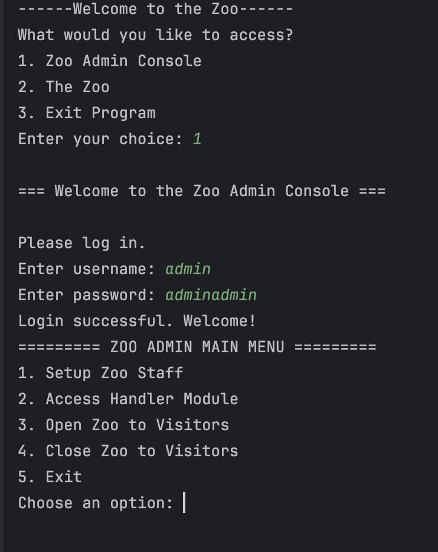

Project Title: Zoo Simulator

Project Objectives Interpret class diagrams, associations, generalizations, and multiplicities from UML. Translate visual design into object-oriented architecture. 

Example Screenshot

